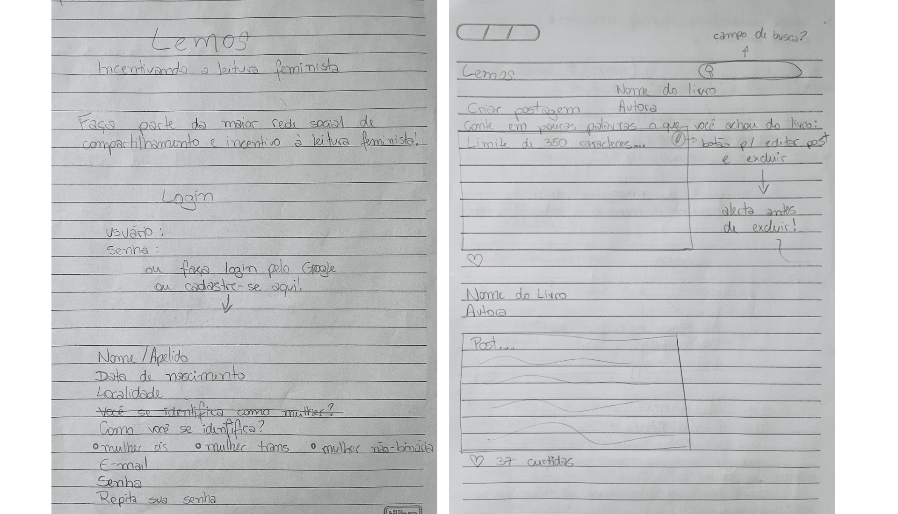
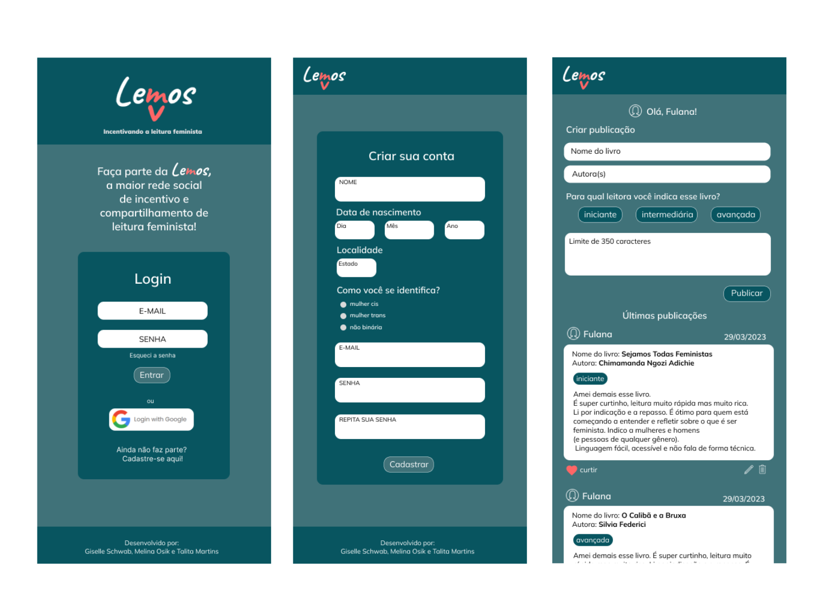

# Social Network

   

## 1. Project Summary

This project is a social network aimed at women who would like to exchange information about books with a feminist theme. The goal is for users to post brief personal opinions in order to share their readings, new authors, and collaborate in guiding beginner readers.

## 2. Prototypes

### 2.1 Low-Fidelity Prototype

### 2.2 High-Fidelity Prototype

For the high-fidelity prototype, the Figma platform was used.

## 3. Testing

### 3.1 Unit Tests

The unit tests for all application functions are passing and cover at least 70% of statements, functions, lines, and branche

## 4. Achieved Objectives
- Use VanillaJS ✔
- Be a SPA. ✔
- Be responsive. ✔
- Collaborative use of Git and GitHub; ✔
- Receive code reviews from at least one peer from another team. ✔
- Conduct unit tests. ✔
- Unit tests cover a minimum of 70% of statements, functions, lines, and branches. ✔
- Perform manual testing to seek errors and simple imperfections. ✔
- Utilize Firebase for authentication and use Firestore. ✔
- Conduct usability testing and incorporate user feedback as improvements. ✔
- Deploy the application and tag the version (git tag). ✔

## 5. Developed by: 

Giselle Schwab Silva  

Melina Osik 

Talita Martins  
